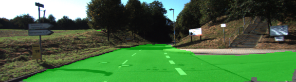

# Semantic Segmentation
## Introduction
In this project, the pixels of road images are labeled using a Fully Convolutional Network (FCN).

## Network Architecture
The network is comprised of two an encoder part and decoder.

### Encoder (FCN-8)
A pre-trained VGG-16 network is used as a starting point to construct a mobileNet. The last layer of the fully connected VGG is replaced by 1x1 convolutional layer, to preserve the spacial information of the images. This enables the classification to output a heatmap instead of just classification.

### Decoder
For the decoder part (to make the classifier back to the same size of the original inage), first the original input is upsampled. Then skip layers are added and added to the network, to fuse information from different pixel sizes of the image. This is done by combining two layers at a time, the first is the output of the previous layer, and the second is the output of a layer further back (normally a pooling layer). In this case the layers 3 and 4 are used as skip layers and added to the output of the each layer accordingly (after ensuring that they are same size).

In order to train the network, regularization and randomization was added to each convolution and transpose layer, which helps the network train quicker. 

### Optimizer
An Adam's optimizer is used to train the network, and cross-entropy is used as the loss function (line 170). 30 epochs were used (fairly stable results after 20 epochs) and a keep probability of 50%, and learning rate 5e-5. A batch size of 16 was used (similar results to batch size of 32 was obtained). 

## Results
The loss resulted in around 0.025 at the final epochs. It can be seen that the performance is relatively good, most of the road segments are correctly labeled, but it has issues with shadows and different colorings.

Here are some results with varying succuss in labeling the road pixels.

### Setup
##### Frameworks and Packages
Make sure you have the following is installed:
 - [Python 3](https://www.python.org/)
 - [TensorFlow](https://www.tensorflow.org/)
 - [NumPy](http://www.numpy.org/)
 - [SciPy](https://www.scipy.org/)
##### Dataset
Download the [Kitti Road dataset](http://www.cvlibs.net/datasets/kitti/eval_road.php) from [here](http://www.cvlibs.net/download.php?file=data_road.zip).  Extract the dataset in the `data` folder.  This will create the folder `data_road` with all the training a test images. The dataset should automatically download when running the main.py script.

